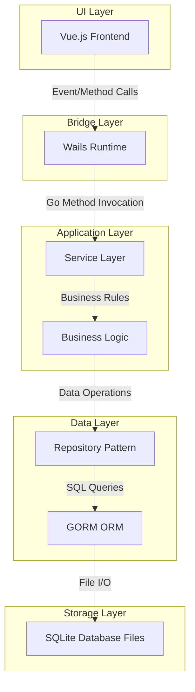
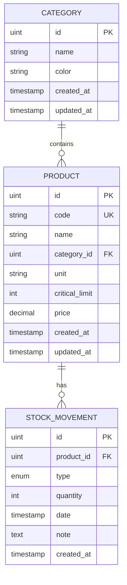

# Portable Multi-Database Stock Management System
## Mimari Tasarım ve İmplementasyon Planı

---

## 📋 İçindekiler

1. [Sistem Mimarisi](#sistem-mimarisi)
2. [Proje Dizin Yapısı](#proje-dizin-yapısı)
3. [Backend Tasarımı (Go)](#backend-tasarımı-go)
4. [Frontend Tasarımı (Vue.js)](#frontend-tasarımı-vuejs)
5. [Veritabanı Detay Tasarımı](#veritabanı-detay-tasarımı)
6. [Core Özellikler ve İmplementasyon Sırası](#core-özellikler-ve-implementasyon-sırası)
7. [Geliştirme Ortamı Kurulumu](#geliştirme-ortamı-kurulumu)
8. [Test Stratejisi](#test-stratejisi)
9. [Build ve Deployment](#build-ve-deployment)
10. [Risk ve Çözümler](#risk-ve-çözümler)

---

## 🏗️ Sistem Mimarisi

### Genel Mimari Yaklaşımı

Uygulama **Katmanlı Mimari (Layered Architecture)** prensiplerine göre tasarlanacak:



### Temel Prensipler

1. **Separation of Concerns**: Her katman kendi sorumluluğunu taşır
2. **Dependency Injection**: Servislerin bağımlılıkları constructor'dan inject edilir
3. **Repository Pattern**: Veritabanı işlemleri soyutlanır
4. **Single Responsibility**: Her modül tek bir işten sorumludur
5. **Error Handling**: Katmanlı hata yönetimi ve recovery mekanizması

---

## 📁 Proje Dizin Yapısı

```
StokTakipDesktop/
├── frontend/                    # Vue.js frontend uygulaması
│   ├── src/
│   │   ├── components/         # Reusable Vue components
│   │   │   ├── common/         # Genel bileşenler (Button, Input, Modal vb.)
│   │   │   ├── database/       # Database seçici bileşenleri
│   │   │   ├── product/        # Ürün yönetimi bileşenleri
│   │   │   ├── movement/       # Stok hareketi bileşenleri
│   │   │   └── filters/        # Filtreleme bileşenleri
│   │   ├── views/              # Ana sayfalar
│   │   │   ├── DatabaseSelector.vue
│   │   │   ├── Dashboard.vue
│   │   │   ├── Products.vue
│   │   │   ├── Movements.vue
│   │   │   └── Reports.vue
│   │   ├── stores/             # Pinia state management
│   │   │   ├── database.js     # Aktif database state
│   │   │   ├── products.js     # Ürün state
│   │   │   └── filters.js      # Filtre state
│   │   ├── composables/        # Vue composition API helpers
│   │   ├── utils/              # Yardımcı fonksiyonlar
│   │   ├── assets/             # Statik dosyalar
│   │   ├── App.vue             # Root component
│   │   └── main.js             # Entry point
│   ├── package.json
│   └── vite.config.js
│
├── backend/                     # Go backend uygulaması
│   ├── cmd/
│   │   └── app/
│   │       └── main.go         # Ana entry point
│   ├── internal/               # Private application code
│   │   ├── app/                # Application layer
│   │   │   ├── app.go          # Wails app struct
│   │   │   └── startup.go      # Initialization logic
│   │   ├── services/           # Business logic services
│   │   │   ├── database_service.go      # DB yönetimi
│   │   │   ├── product_service.go       # Ürün işlemleri
│   │   │   ├── movement_service.go      # Hareket işlemleri
│   │   │   ├── category_service.go      # Kategori işlemleri
│   │   │   └── filter_service.go        # Filtreleme işlemleri
│   │   ├── repositories/       # Data access layer
│   │   │   ├── base_repository.go
│   │   │   ├── product_repository.go
│   │   │   ├── movement_repository.go
│   │   │   └── category_repository.go
│   │   ├── models/             # Database models (GORM)
│   │   │   ├── product.go
│   │   │   ├── movement.go
│   │   │   ├── category.go
│   │   │   └── common.go       # Shared model fields
│   │   ├── dto/                # Data Transfer Objects
│   │   │   ├── requests.go     # Request DTOs
│   │   │   └── responses.go    # Response DTOs
│   │   ├── database/           # Database management
│   │   │   ├── connection.go   # Connection manager
│   │   │   ├── migrations.go   # Auto migrations
│   │   │   └── seed.go         # Initial data seeding
│   │   ├── utils/              # Utilities
│   │   │   ├── path.go         # Path management
│   │   │   ├── logger.go       # Logging
│   │   │   └── validator.go    # Input validation
│   │   └── config/             # Configuration
│   │       ├── config.go       # Config struct
│   │       └── manager.go      # Config file manager
│   ├── pkg/                    # Public reusable packages
│   │   └── errors/             # Custom error types
│   ├── go.mod
│   └── go.sum
│
├── build/                       # Build artifacts ve resources
│   ├── windows/
│   │   └── icon.ico
│   └── appicon.png
│
├── docs/                        # Dokümantasyon
│   ├── api.md                  # Backend API docs
│   └── user-guide.md           # Kullanıcı kılavuzu
│
├── wails.json                   # Wails configuration
├── go.mod                       # Go module definition
├── go.sum
├── .gitignore
└── README.md

# Runtime dizin yapısı (Build sonrası)
RuntimeFolder/
├── StockApp.exe                 # Ana çalıştırılabilir
├── config.json                  # Kullanıcı tercihleri
└── Data/                        # Veritabanı klasörü
    ├── Depo_A.db
    └── Yedek_Parca.db
```

---

## 🔧 Backend Tasarımı (Go)

### 1. Models (GORM Models)

#### Category Model
```go
type Category struct {
    ID        uint      `gorm:"primaryKey" json:"id"`
    Name      string    `gorm:"size:100;not null;index" json:"name"`
    Color     string    `gorm:"size:7" json:"color"` // HEX color
    CreatedAt time.Time `json:"created_at"`
    UpdatedAt time.Time `json:"updated_at"`
    
    // Relations
    Products []Product `gorm:"foreignKey:CategoryID" json:"-"`
}
```

#### Product Model
```go
type Product struct {
    ID            uint      `gorm:"primaryKey" json:"id"`
    Code          string    `gorm:"size:50;uniqueIndex;not null" json:"code"`
    Name          string    `gorm:"size:200;not null;index" json:"name"`
    CategoryID    uint      `gorm:"not null;index" json:"category_id"`
    Unit          string    `gorm:"size:20;not null" json:"unit"` // adet, kg, litre vb.
    CriticalLimit int       `gorm:"default:0" json:"critical_limit"`
    Price         float64   `gorm:"type:decimal(10,2);default:0" json:"price"`
    CreatedAt     time.Time `json:"created_at"`
    UpdatedAt     time.Time `json:"updated_at"`
    
    // Relations
    Category  Category         `gorm:"foreignKey:CategoryID" json:"category"`
    Movements []StockMovement  `gorm:"foreignKey:ProductID" json:"-"`
}

// Computed field - will be calculated on demand
type ProductWithStock struct {
    Product
    CurrentStock int     `json:"current_stock"`
    StockValue   float64 `json:"stock_value"` // CurrentStock * Price
    IsLowStock   bool    `json:"is_low_stock"`
}
```

#### StockMovement Model
```go
type MovementType string

const (
    MovementTypeIn  MovementType = "IN"
    MovementTypeOut MovementType = "OUT"
)

type StockMovement struct {
    ID        uint         `gorm:"primaryKey" json:"id"`
    ProductID uint         `gorm:"not null;index" json:"product_id"`
    Type      MovementType `gorm:"type:varchar(3);not null;index" json:"type"`
    Quantity  int          `gorm:"not null" json:"quantity"` // Always positive
    Date      time.Time    `gorm:"not null;index" json:"date"`
    Note      string       `gorm:"type:text" json:"note"`
    CreatedAt time.Time    `json:"created_at"`
    
    // Relations
    Product Product `gorm:"foreignKey:ProductID" json:"product"`
}
```

### 2. Repositories (Data Access Layer)

#### Base Repository Interface
```go
type BaseRepository[T any] interface {
    Create(entity *T) error
    Update(entity *T) error
    Delete(id uint) error
    FindByID(id uint) (*T, error)
    FindAll() ([]T, error)
    Count() (int64, error)
}
```

#### Product Repository
```go
type ProductRepository interface {
    BaseRepository[models.Product]
    
    FindByCode(code string) (*models.Product, error)
    FindByCategory(categoryID uint) ([]models.Product, error)
    Search(query string) ([]models.Product, error)
    
    // Complex queries
    FindWithStock() ([]models.ProductWithStock, error)
    FindLowStock() ([]models.ProductWithStock, error)
    FindWithFilters(filters FilterOptions) ([]models.ProductWithStock, error)
    
    // Pagination
    FindWithPagination(page, pageSize int, filters FilterOptions) ([]models.ProductWithStock, int64, error)
}
```

#### Movement Repository
```go
type MovementRepository interface {
    BaseRepository[models.StockMovement]
    
    FindByProduct(productID uint) ([]models.StockMovement, error)
    FindByDateRange(start, end time.Time) ([]models.StockMovement, error)
    FindByType(movementType models.MovementType) ([]models.StockMovement, error)
    
    // Calculations
    CalculateStock(productID uint) (int, error)
    GetRecentMovements(limit int) ([]models.StockMovement, error)
}
```

### 3. Services (Business Logic)

#### Database Service
```go
type DatabaseService struct {
    currentDB     *gorm.DB
    dbPath        string
    configManager *config.Manager
}

// Wails'e expose edilecek metodlar
func (s *DatabaseService) ListDatabases() ([]DatabaseInfo, error)
func (s *DatabaseService) CreateDatabase(name string) error
func (s *DatabaseService) SwitchDatabase(path string) error
func (s *DatabaseService) GetCurrentDatabase() (DatabaseInfo, error)
func (s *DatabaseService) ExportDatabase(targetPath string) error
func (s *DatabaseService) BackupDatabase() error
```

#### Product Service
```go
type ProductService struct {
    repo     repositories.ProductRepository
    mvmtRepo repositories.MovementRepository
    catRepo  repositories.CategoryRepository
}

// Wails'e expose edilecek metodlar
func (s *ProductService) CreateProduct(req dto.CreateProductRequest) (dto.ProductResponse, error)
func (s *ProductService) UpdateProduct(id uint, req dto.UpdateProductRequest) error
func (s *ProductService) DeleteProduct(id uint) error
func (s *ProductService) GetProduct(id uint) (dto.ProductResponse, error)
func (s *ProductService) GetProducts(filters dto.FilterRequest) (dto.ProductListResponse, error)
func (s *ProductService) SearchProducts(query string) ([]dto.ProductResponse, error)
func (s *ProductService) GetLowStockProducts() ([]dto.ProductResponse, error)
func (s *ProductService) ValidateProductCode(code string) (bool, error)
```

#### Movement Service
```go
type MovementService struct {
    repo        repositories.MovementRepository
    productRepo repositories.ProductRepository
}

func (s *MovementService) CreateMovement(req dto.CreateMovementRequest) error {
    // 1. Validate product exists
    // 2. Check if OUT movement exceeds current stock
    // 3. Create movement record
    // 4. Return updated stock info
}

func (s *MovementService) GetMovements(productID uint, filters dto.DateRangeFilter) ([]dto.MovementResponse, error)
func (s *MovementService) GetRecentMovements(limit int) ([]dto.MovementResponse, error)
func (s *MovementService) DeleteMovement(id uint) error
func (s *MovementService) GetStockHistory(productID uint) (dto.StockHistoryResponse, error)
```

### 4. Path Management (Taşınabilirlik için kritik)

```go
package utils

import (
    "os"
    "path/filepath"
)

type PathManager struct {
    executablePath string
    rootPath       string
}

func NewPathManager() (*PathManager, error) {
    execPath, err := os.Executable()
    if err != nil {
        return nil, err
    }
    
    rootPath := filepath.Dir(execPath)
    
    return &PathManager{
        executablePath: execPath,
        rootPath:       rootPath,
    }, nil
}

func (pm *PathManager) GetDataFolder() string {
    return filepath.Join(pm.rootPath, "Data")
}

func (pm *PathManager) GetConfigPath() string {
    return filepath.Join(pm.rootPath, "config.json")
}

func (pm *PathManager) EnsureDataFolder() error {
    dataFolder := pm.GetDataFolder()
    return os.MkdirAll(dataFolder, 0755)
}
```

### 5. Database Connection Manager (Singleton Pattern)

```go
type ConnectionManager struct {
    db         *gorm.DB
    dbPath     string
    mutex      sync.RWMutex
    pathMgr    *utils.PathManager
}

var (
    instance *ConnectionManager
    once     sync.Once
)

func GetConnectionManager() *ConnectionManager {
    once.Do(func() {
        instance = &ConnectionManager{
            pathMgr: utils.NewPathManager(),
        }
    })
    return instance
}

func (cm *ConnectionManager) Connect(dbFileName string) error {
    cm.mutex.Lock()
    defer cm.mutex.Unlock()
    
    // Close existing connection
    if cm.db != nil {
        sqlDB, _ := cm.db.DB()
        sqlDB.Close()
    }
    
    // Build full path
    dbPath := filepath.Join(cm.pathMgr.GetDataFolder(), dbFileName)
    
    // Open new connection
    db, err := gorm.Open(sqlite.Open(dbPath), &gorm.Config{
        Logger: logger.Default.LogMode(logger.Silent),
    })
    
    if err != nil {
        return err
    }
    
    // Auto migrate
    if err := runMigrations(db); err != nil {
        return err
    }
    
    cm.db = db
    cm.dbPath = dbPath
    
    return nil
}

func (cm *ConnectionManager) GetDB() *gorm.DB {
    cm.mutex.RLock()
    defer cm.mutex.RUnlock()
    return cm.db
}
```

### 6. Error Handling & Recovery

```go
package errors

type AppError struct {
    Code    string
    Message string
    Err     error
}

const (
    ErrCodeDBConnection    = "DB_CONNECTION_ERROR"
    ErrCodeNotFound        = "NOT_FOUND"
    ErrCodeValidation      = "VALIDATION_ERROR"
    ErrCodeInsufficientStock = "INSUFFICIENT_STOCK"
    ErrCodeDuplicateCode   = "DUPLICATE_CODE"
)

// Panic recovery middleware
func RecoverMiddleware(next func() error) error {
    defer func() {
        if r := recover(); r != nil {
            log.Printf("Recovered from panic: %v", r)
            // Log stack trace
            debug.PrintStack()
        }
    }()
    return next()
}
```

---

## 🎨 Frontend Tasarımı (Vue.js)

### 1. State Management (Pinia)

#### Database Store
```javascript
// stores/database.js
import { defineStore } from 'pinia'
import { ListDatabases, SwitchDatabase, CreateDatabase } from '../../wailsjs/go/services/DatabaseService'

export const useDatabaseStore = defineStore('database', {
  state: () => ({
    databases: [],
    currentDatabase: null,
    isLoading: false,
    error: null
  }),
  
  actions: {
    async loadDatabases() {
      this.isLoading = true
      try {
        this.databases = await ListDatabases()
      } catch (error) {
        this.error = error.message
      } finally {
        this.isLoading = false
      }
    },
    
    async selectDatabase(dbPath) {
      try {
        await SwitchDatabase(dbPath)
        this.currentDatabase = dbPath
        // Navigate to dashboard
      } catch (error) {
        this.error = error.message
      }
    },
    
    async createNewDatabase(name) {
      try {
        await CreateDatabase(name)
        await this.loadDatabases()
      } catch (error) {
        this.error = error.message
      }
    }
  }
})
```

#### Product Store
```javascript
// stores/products.js
import { defineStore } from 'pinia'
import { GetProducts, CreateProduct, UpdateProduct, DeleteProduct } from '../../wailsjs/go/services/ProductService'

export const useProductStore = defineStore('products', {
  state: () => ({
    products: [],
    currentProduct: null,
    pagination: {
      page: 1,
      pageSize: 50,
      total: 0
    },
    filters: {
      search: '',
      categoryIds: [],
      stockStatus: 'all', // all, low, out, normal
      dateRange: null,
      priceRange: { min: null, max: null }
    },
    isLoading: false
  }),
  
  getters: {
    filteredProducts: (state) => {
      // Client-side filtering logic (as fallback)
      return state.products
    },
    
    lowStockProducts: (state) => {
      return state.products.filter(p => p.is_low_stock)
    }
  },
  
  actions: {
    async fetchProducts() {
      this.isLoading = true
      try {
        const response = await GetProducts(this.filters)
        this.products = response.products
        this.pagination.total = response.total
      } catch (error) {
        console.error('Failed to fetch products:', error)
      } finally {
        this.isLoading = false
      }
    },
    
    async createProduct(productData) {
      try {
        const newProduct = await CreateProduct(productData)
        await this.fetchProducts() // Refresh list
        return newProduct
      } catch (error) {
        throw error
      }
    },
    
    setFilter(key, value) {
      this.filters[key] = value
      this.pagination.page = 1 // Reset to first page
      this.fetchProducts()
    }
  }
})
```

### 2. Component Yapısı

#### Ana Layout Komponenti
```vue
<!-- App.vue -->
<template>
  <div id="app" class="min-h-screen bg-gray-50">
    <router-view />
  </div>
</template>
```

#### Database Selector View
```vue
<!-- views/DatabaseSelector.vue -->
<template>
  <div class="flex items-center justify-center min-h-screen bg-gradient-to-br from-blue-50 to-indigo-100">
    <div class="w-full max-w-2xl p-8 bg-white rounded-lg shadow-xl">
      <h1 class="text-3xl font-bold text-gray-800 mb-6">Stok Takip Sistemi</h1>
      
      <div class="mb-6">
        <h2 class="text-lg font-semibold mb-3">Mevcut Veritabanları</h2>
        <div class="space-y-2">
          <div
            v-for="db in databases"
            :key="db.path"
            @click="selectDatabase(db.path)"
            class="p-4 border rounded-lg hover:bg-blue-50 cursor-pointer transition"
          >
            <div class="flex justify-between items-center">
              <div>
                <p class="font-medium">{{ db.name }}</p>
                <p class="text-sm text-gray-500">{{ db.path }}</p>
              </div>
              <div class="text-sm text-gray-600">
                {{ db.size }} MB
              </div>
            </div>
          </div>
        </div>
      </div>
      
      <button @click="showCreateDialog = true" class="w-full py-3 bg-blue-600 text-white rounded-lg hover:bg-blue-700">
        + Yeni Veritabanı Oluştur
      </button>
    </div>
    
    <CreateDatabaseModal v-if="showCreateDialog" @close="showCreateDialog = false" />
  </div>
</template>
```

#### Product List Component
```vue
<!-- components/product/ProductList.vue -->
<template>
  <div class="bg-white rounded-lg shadow">
    <!-- Filter bar -->
    <div class="p-4 border-b">
      <ProductFilters @filter-change="handleFilterChange" />
    </div>
    
    <!-- Product table -->
    <div class="overflow-x-auto">
      <table class="w-full">
        <thead class="bg-gray-50">
          <tr>
            <th class="px-6 py-3 text-left text-xs font-medium text-gray-500 uppercase">Kod</th>
            <th class="px-6 py-3 text-left text-xs font-medium text-gray-500 uppercase">Ürün Adı</th>
            <th class="px-6 py-3 text-left text-xs font-medium text-gray-500 uppercase">Kategori</th>
            <th class="px-6 py-3 text-left text-xs font-medium text-gray-500 uppercase">Stok</th>
            <th class="px-6 py-3 text-left text-xs font-medium text-gray-500 uppercase">Birim</th>
            <th class="px-6 py-3 text-left text-xs font-medium text-gray-500 uppercase">Fiyat</th>
            <th class="px-6 py-3 text-left text-xs font-medium text-gray-500 uppercase">İşlemler</th>
          </tr>
        </thead>
        <tbody class="divide-y divide-gray-200">
          <tr
            v-for="product in products"
            :key="product.id"
            class="hover:bg-gray-50 transition"
            :class="{ 'bg-red-50': product.is_low_stock }"
          >
            <td class="px-6 py-4 whitespace-nowrap text-sm font-medium">{{ product.code }}</td>
            <td class="px-6 py-4 whitespace-nowrap text-sm">{{ product.name }}</td>
            <td class="px-6 py-4 whitespace-nowrap text-sm">
              <span class="px-2 py-1 rounded-full text-xs" :style="{ backgroundColor: product.category.color }">
                {{ product.category.name }}
              </span>
            </td>
            <td class="px-6 py-4 whitespace-nowrap text-sm font-semibold">
              {{ product.current_stock }}
              <span v-if="product.is_low_stock" class="text-red-600 ml-2">⚠️</span>
            </td>
            <td class="px-6 py-4 whitespace-nowrap text-sm">{{ product.unit }}</td>
            <td class="px-6 py-4 whitespace-nowrap text-sm">{{ formatCurrency(product.price) }}</td>
            <td class="px-6 py-4 whitespace-nowrap text-sm">
              <button @click="editProduct(product)" class="text-blue-600 hover:text-blue-900 mr-3">Düzenle</button>
              <button @click="showMovements(product)" class="text-green-600 hover:text-green-900">Hareket</button>
            </td>
          </tr>
        </tbody>
      </table>
    </div>
    
    <!-- Pagination -->
    <div class="p-4 border-t">
      <Pagination
        :current-page="currentPage"
        :total-pages="totalPages"
        @page-change="handlePageChange"
      />
    </div>
  </div>
</template>
```

#### Advanced Filter Component
```vue
<!-- components/filters/ProductFilters.vue -->
<template>
  <div class="space-y-4">
    <div class="grid grid-cols-1 md:grid-cols-4 gap-4">
      <!-- Search input -->
      <div class="col-span-2">
        <input
          v-model="localFilters.search"
          @input="debounceSearch"
          type="text"
          placeholder="Ürün adı veya kod ile ara..."
          class="w-full px-4 py-2 border rounded-lg focus:ring-2 focus:ring-blue-500"
        />
      </div>
      
      <!-- Category filter -->
      <div>
        <select v-model="localFilters.categoryId" class="w-full px-4 py-2 border rounded-lg">
          <option :value="null">Tüm Kategoriler</option>
          <option v-for="cat in categories" :key="cat.id" :value="cat.id">
            {{ cat.name }}
          </option>
        </select>
      </div>
      
      <!-- Stock status filter -->
      <div>
        <select v-model="localFilters.stockStatus" class="w-full px-4 py-2 border rounded-lg">
          <option value="all">Tüm Ürünler</option>
          <option value="low">Kritik Stoktakiler</option>
          <option value="out">Stokta Olmayanlar</option>
          <option value="normal">Normal Stok</option>
        </select>
      </div>
    </div>
    
    <!-- Advanced filters toggle -->
    <div v-if="showAdvanced" class="grid grid-cols-1 md:grid-cols-3 gap-4 pt-4 border-t">
      <!-- Date range -->
      <div>
        <label class="block text-sm font-medium mb-1">Tarih Aralığı</label>
        <input v-model="localFilters.dateFrom" type="date" class="w-full px-3 py-2 border rounded" />
        <input v-model="localFilters.dateTo" type="date" class="w-full px-3 py-2 border rounded mt-2" />
      </div>
      
      <!-- Price range -->
      <div>
        <label class="block text-sm font-medium mb-1">Fiyat Aralığı</label>
        <input v-model.number="localFilters.priceMin" type="number" placeholder="Min" class="w-full px-3 py-2 border rounded" />
        <input v-model.number="localFilters.priceMax" type="number" placeholder="Max" class="w-full px-3 py-2 border rounded mt-2" />
      </div>
      
      <!-- Quantity range -->
      <div>
        <label class="block text-sm font-medium mb-1">Miktar Aralığı</label>
        <input v-model.number="localFilters.qtyMin" type="number" placeholder="Min" class="w-full px-3 py-2 border rounded" />
        <input v-model.number="localFilters.qtyMax" type="number" placeholder="Max" class="w-full px-3 py-2 border rounded mt-2" />
      </div>
    </div>
    
    <div class="flex justify-between items-center">
      <button @click="showAdvanced = !showAdvanced" class="text-blue-600 text-sm">
        {{ showAdvanced ? 'Gelişmiş Filtreleri Gizle' : 'Gelişmiş Filtreler' }}
      </button>
      <button @click="resetFilters" class="text-gray-600 text-sm hover:text-gray-900">
        Filtreleri Sıfırla
      </button>
    </div>
  </div>
</template>

<script setup>
import { ref, reactive, watch } from 'vue'
import { debounce } from 'lodash-es'

const emit = defineEmits(['filter-change'])

const showAdvanced = ref(false)
const localFilters = reactive({
  search: '',
  categoryId: null,
  stockStatus: 'all',
  dateFrom: null,
  dateTo: null,
  priceMin: null,
  priceMax: null,
  qtyMin: null,
  qtyMax: null
})

const debounceSearch = debounce(() => {
  emit('filter-change', localFilters)
}, 300)

watch(localFilters, (newFilters) => {
  emit('filter-change', newFilters)
})

const resetFilters = () => {
  Object.keys(localFilters).forEach(key => {
    localFilters[key] = key === 'stockStatus' ? 'all' : null
  })
  localFilters.search = ''
}
</script>
```

### 3. Routing

```javascript
// router/index.js
import { createRouter, createWebHashHistory } from 'vue-router'
import DatabaseSelector from '@/views/DatabaseSelector.vue'
import Dashboard from '@/views/Dashboard.vue'
import Products from '@/views/Products.vue'
import Movements from '@/views/Movements.vue'
import Reports from '@/views/Reports.vue'

const routes = [
  {
    path: '/',
    name: 'DatabaseSelector',
    component: DatabaseSelector
  },
  {
    path: '/dashboard',
    name: 'Dashboard',
    component: Dashboard,
    meta: { requiresDB: true }
  },
  {
    path: '/products',
    name: 'Products',
    component: Products,
    meta: { requiresDB: true }
  },
  {
    path: '/movements',
    name: 'Movements',
    component: Movements,
    meta: { requiresDB: true }
  },
  {
    path: '/reports',
    name: 'Reports',
    component: Reports,
    meta: { requiresDB: true }
  }
]

const router = createRouter({
  history: createWebHashHistory(),
  routes
})

// Navigation guard
router.beforeEach((to, from, next) => {
  const dbStore = useDatabaseStore()
  
  if (to.meta.requiresDB && !dbStore.currentDatabase) {
    next('/')
  } else {
    next()
  }
})

export default router
```

---

## 🗄️ Veritabanı Detay Tasarımı

### ER Diagram



### Index Stratejisi

**Performans için kritik indexler:**

1. `products.code` - UNIQUE INDEX (Hızlı kod araması)
2. `products.name` - INDEX (İsim bazlı arama)
3. `products.category_id` - INDEX (Kategoriye göre filtreleme)
4. `stock_movements.product_id` - INDEX (Ürün hareketleri)
5. `stock_movements.date` - INDEX (Tarih bazlı sorgular)
6. `stock_movements.type` - INDEX (Giriş/Çıkış filtreleme)

### Örnek SQL Sorguları (GORM'da oluşturulacak)

#### Stok Hesaplama
```sql
SELECT 
    p.id,
    p.code,
    p.name,
    COALESCE(SUM(CASE WHEN sm.type = 'IN' THEN sm.quantity ELSE 0 END), 0) - 
    COALESCE(SUM(CASE WHEN sm.type = 'OUT' THEN sm.quantity ELSE 0 END), 0) as current_stock,
    p.critical_limit,
    CASE 
        WHEN (COALESCE(SUM(CASE WHEN sm.type = 'IN' THEN sm.quantity ELSE 0 END), 0) - 
              COALESCE(SUM(CASE WHEN sm.type = 'OUT' THEN sm.quantity ELSE 0 END), 0)) <= p.critical_limit 
        THEN 1 
        ELSE 0 
    END as is_low_stock
FROM products p
LEFT JOIN stock_movements sm ON p.id = sm.product_id
GROUP BY p.id
```

#### Son Hareketler
```sql
SELECT 
    sm.*,
    p.code,
    p.name
FROM stock_movements sm
INNER JOIN products p ON sm.product_id = p.id
ORDER BY sm.date DESC
LIMIT 50
```

### Migration Strategy

**İlk çalıştırmada otomatik olarak oluşturulacak:**

```go
func runMigrations(db *gorm.DB) error {
    // Auto migrate tables
    if err := db.AutoMigrate(
        &models.Category{},
        &models.Product{},
        &models.StockMovement{},
    ); err != nil {
        return err
    }
    
    // Create default categories if database is empty
    var count int64
    db.Model(&models.Category{}).Count(&count)
    if count == 0 {
        defaultCategories := []models.Category{
            {Name: "Genel", Color: "#6B7280"},
            {Name: "Elektronik", Color: "#3B82F6"},
            {Name: "Yedek Parça", Color: "#EF4444"},
            {Name: "Malzeme", Color: "#10B981"},
        }
        
        for _, cat := range defaultCategories {
            db.Create(&cat)
        }
    }
    
    return nil
}
```

---

## 🚀 Core Özellikler ve İmplementasyon Sırası

### Faz 1: Temel Altyapı (1. Sprint)

#### 1.1 Proje Kurulumu
- [x] Wails projesi oluşturma
- [x] Go modül yapısını kurma
- [x] Frontend (Vue 3 + Vite) kurulumu
- [x] Dizin yapısını oluşturma

#### 1.2 Path Management & Config
- [x] PathManager implementasyonu
- [x] Config dosyası okuma/yazma
- [x] Data klasörü oluşturma

#### 1.3 Database Foundation
- [x] ConnectionManager (Singleton)
- [x] GORM modelleri tanımlama
- [x] Auto migration sistemi
- [x] Seed data

### Faz 2: Database Yönetimi (2. Sprint)

#### 2.1 Backend
- [x] DatabaseService implementasyonu
- [x] Database listeleme
- [x] Yeni database oluşturma
- [x] Database switch fonksiyonu

#### 2.2 Frontend
- [x] DatabaseSelector view
- [x] Database store (Pinia)
- [x] Database oluşturma modalı
- [x] Database listesi UI

### Faz 3: Kategori Yönetimi (3. Sprint)

#### 3.1 Backend
- [x] Category model ve repository
- [x] CategoryService (CRUD operations)

#### 3.2 Frontend
- [x] Category yönetim sayfası
- [x] Category seçici component
- [x] Renk picker

### Faz 4: Ürün Yönetimi (4. Sprint)

#### 4.1 Backend
- [x] Product model ve repository
- [x] ProductService (CRUD operations)
- [x] Stok hesaplama fonksiyonu
- [x] Validation (unique code check)

#### 4.2 Frontend
- [x] Product list view
- [x] Product form (create/edit)
- [x] Product detail modal
- [x] Product store

### Faz 5: Stok Hareketi (5. Sprint)

#### 5.1 Backend
- [x] StockMovement model ve repository
- [x] MovementService
- [x] Negatif stok kontrolü
- [x] Stok geçmişi sorgulama

#### 5.2 Frontend
- [x] Movement form (IN/OUT)
- [x] Movement history component
- [x] Movement list view
- [x] Validation ve uyarılar

### Faz 6: Gelişmiş Filtreleme (6. Sprint)

#### 6.1 Backend
- [x] FilterService implementasyonu
- [x] Dynamic query builder
- [x] Pagination support
- [x] Sort operations

#### 6.2 Frontend
- [x] Advanced filter component
- [x] Filter state management
- [x] Debounced search
- [x] Filter chips (aktif filtreleri gösterme)

### Faz 7: Dashboard & Reports (7. Sprint)

#### 7.1 Backend
- [x] Dashboard istatistikleri servisi
- [x] Report generation
- [x] Export fonksiyonları

#### 7.2 Frontend
- [x] Dashboard view
- [x] Charts (Recharts kullanarak)
- [x] Stat cards
- [x] Recent activities

### Faz 8: Polish & Optimization (8. Sprint)

#### 8.1 Performance
- [x] Lazy loading implementation
- [x] Virtual scrolling (büyük listeler için)
- [x] Query optimization
- [x] Caching stratejisi

#### 8.2 UX İyileştirmeleri
- [x] Loading states
- [x] Error handling UI
- [x] Toast notifications
- [x] Keyboard shortcuts

#### 8.3 Testing & Bug Fixes
- [x] Unit testler
- [x] Integration testler
- [x] Bug fixing
- [x] Performance profiling

---

## 💻 Geliştirme Ortamı Kurulumu

### Gereksinimler

**Sistem Gereksinimleri:**
- Windows 10/11 (64-bit)
- 8 GB RAM (minimum)
- 2 GB boş disk alanı

**Yazılım Gereksinimleri:**

1. **Go (Golang)** - v1.21 veya üzeri
   ```bash
   # İndirme: https://go.dev/dl/
   # Doğrulama:
   go version
   ```

2. **Node.js** - v18 LTS veya üzeri
   ```bash
   # İndirme: https://nodejs.org/
   # Doğrulama:
   node --version
   npm --version
   ```

3. **Wails CLI** - Latest version
   ```bash
   go install github.com/wailsapp/wails/v2/cmd/wails@latest
   
   # Doğrulama:
   wails doctor
   ```

4. **Git** - Version control
   ```bash
   # İndirme: https://git-scm.com/
   git --version
   ```

5. **VSCode** (Önerilen) veya GoLand
   - Go extension
   - Vue extension (Volar)

### Kurulum Adımları

```bash
# 1. Wails projesi oluştur
wails init -n StokTakipDesktop -t vue

# 2. Proje dizinine gir
cd StokTakipDesktop

# 3. Go bağımlılıklarını yükle
go mod download

# 4. Frontend bağımlılıklarını yükle
cd frontend
npm install

# 5. Geliştirme modunda çalıştır
cd ..
wails dev

# 6. Production build (test için)
wails build
```

### Gerekli Go Paketleri

```bash
# GORM ve SQLite driver
go get -u gorm.io/gorm
go get -u gorm.io/driver/sqlite

# Utilities
go get -u github.com/google/uuid
go get -u github.com/joho/godotenv
```

### Frontend Bağımlılıkları

```json
{
  "dependencies": {
    "vue": "^3.3.0",
    "vue-router": "^4.2.0",
    "pinia": "^2.1.0",
    "lodash-es": "^4.17.21"
  },
  "devDependencies": {
    "@vitejs/plugin-vue": "^4.0.0",
    "vite": "^4.3.0",
    "autoprefixer": "^10.4.14",
    "postcss": "^8.4.24",
    "tailwindcss": "^3.3.0"
  }
}
```

---

## 🧪 Test Stratejisi

### Backend Testing

#### Unit Tests (Go)
```go
// internal/services/product_service_test.go
func TestProductService_CreateProduct(t *testing.T) {
    // Setup mock repository
    mockRepo := &MockProductRepository{}
    service := NewProductService(mockRepo)
    
    // Test case
    req := dto.CreateProductRequest{
        Code: "TEST001",
        Name: "Test Product",
        // ...
    }
    
    product, err := service.CreateProduct(req)
    
    assert.NoError(t, err)
    assert.Equal(t, "TEST001", product.Code)
}
```

#### Integration Tests
```go
// internal/database/connection_test.go
func TestDatabaseConnection(t *testing.T) {
    // Test with temporary database
    tempDB := filepath.Join(os.TempDir(), "test.db")
    defer os.Remove(tempDB)
    
    manager := GetConnectionManager()
    err := manager.Connect(tempDB)
    
    assert.NoError(t, err)
    assert.NotNil(t, manager.GetDB())
}
```

### Frontend Testing

#### Component Tests (Vitest)
```javascript
// components/product/ProductList.spec.js
import { mount } from '@vue/test-utils'
import { describe, it, expect } from 'vitest'
import ProductList from './ProductList.vue'

describe('ProductList', () => {
  it('renders products correctly', () => {
    const wrapper = mount(ProductList, {
      props: {
        products: [
          { id: 1, code: 'P001', name: 'Product 1' }
        ]
      }
    })
    
    expect(wrapper.find('td').text()).toContain('P001')
  })
})
```

### Manuel Test Senaryoları

1. **Database Operations**
   - [ ] Yeni database oluşturma
   - [ ] Mevcut database'leri listeleme
   - [ ] Database arası geçiş yapma
   - [ ] Flash disk çıkarılınca hata yönetimi

2. **Product CRUD**
   - [ ] Yeni ürün ekleme
   - [ ] Duplicate code kontrolü
   - [ ] Ürün güncelleme
   - [ ] Ürün silme (stok hareketi varsa uyarı)

3. **Stock Movements**
   - [ ] Giriş hareketi ekleme
   - [ ] Çıkış hareketi ekleme
   - [ ] Negatif stok kontrolü
   - [ ] Stok geçmişi görüntüleme

4. **Filtering**
   - [ ] Arama (fuzzy)
   - [ ] Kategori filtresi
   - [ ] Stok durumu filtresi
   - [ ] Tarih aralığı filtresi
   - [ ] Çoklu filtre kombinasyonu

5. **Performance**
   - [ ] 10,000 ürün ile test
   - [ ] Pagination testi
   - [ ] Lazy loading testi
   - [ ] Concurrent database access

---

## 📦 Build ve Deployment

### Development Build

```bash
# Hot reload ile geliştirme
wails dev

# Debug mode
wails dev -debug
```

### Production Build

```bash
# Windows için release build
wails build -clean -platform windows/amd64

# Build output:
# build/bin/StockApp.exe
```

### Build Konfigürasyonu

```json
// wails.json
{
  "name": "StokTakipDesktop",
  "outputfilename": "StockApp",
  "frontend:install": "npm install",
  "frontend:build": "npm run build",
  "frontend:dev": "npm run dev",
  "frontend:dev:watcher": "npm run dev",
  "author": {
    "name": "Your Name",
    "email": "your.email@example.com"
  },
  "info": {
    "companyName": "Your Company",
    "productName": "Stok Takip Sistemi",
    "productVersion": "1.0.0",
    "copyright": "Copyright © 2024",
    "comments": "Portable Stock Management System"
  },
  "wailsjsdir": "./frontend",
  "assetdir": "./frontend/dist",
  "reloaddirs": "internal,frontend/src"
}
```

### Deployment Paketi Hazırlama

**Manuel adımlar:**

1. Build executable oluştur
2. Gerekli dizinleri oluştur:
```
StokTakipSistemi/
├── StockApp.exe
├── config.json (örnek)
└── Data/ (boş klasör)
```

3. README.txt ekle:
```
Stok Takip Sistemi - Kurulum

1. Tüm klasörü istediğiniz yere (flash disk dahil) kopyalayın
2. StockApp.exe'yi çalıştırın
3. İlk açılışta yeni veritabanı oluşturun

Not: Program çalıştığı konumdaki Data klasöründe veritabanlarını saklar.
Flash disk takılı olduğu sürece çalışır.
```

4. ZIP olarak paketleme
```bash
# PowerShell
Compress-Archive -Path StokTakipSistemi -DestinationPath StokTakipSistemi_v1.0.0.zip
```

### Release Checklist

- [ ] Tüm testler başarılı
- [ ] Performance profiling yapıldı
- [ ] Memory leaks kontrol edildi
- [ ] Error handling test edildi
- [ ] UI/UX review
- [ ] Documentation hazır
- [ ] Build başarılı
- [ ] Manuel test senaryoları geçti
- [ ] Version number güncellendi
- [ ] CHANGELOG.md güncellendi

---

## ⚠️ Risk ve Çözümler

### Risk 1: Flash Disk Bağlantısı Kesilmesi

**Senaryo:** Kullanıcı uygulama çalışırken flash diski çıkarır.

**Çözüm:**
```go
// Panic recovery middleware
defer func() {
    if r := recover(); r != nil {
        // Log error
        logger.Error("Database connection lost")
        
        // Show user-friendly error
        runtime.MessageDialog(ctx, runtime.MessageDialogOptions{
            Type:    runtime.ErrorDialog,
            Title:   "Bağlantı Hatası",
            Message: "Veritabanı bağlantısı kesildi. Lütfen flash diski kontrol edin.",
        })
        
        // Redirect to database selector
        runtime.EventsEmit(ctx, "database:connection-lost")
    }
}()
```

### Risk 2: Concurrent Database Access

**Senaryo:** Aynı database'e çoklu işlem yapılması.

**Çözüm:**
- GORM connection pooling kullan
- Read/Write mutex implementation
- Transaction yönetimi

```go
type SafeRepository struct {
    db    *gorm.DB
    mutex sync.RWMutex
}

func (r *SafeRepository) Create(entity interface{}) error {
    r.mutex.Lock()
    defer r.mutex.Unlock()
    
    return r.db.Create(entity).Error
}
```

### Risk 3: Large Dataset Performance

**Senaryo:** 100,000+ ürün ile performans kaybı.

**Çözüm:**
- Pagination (sayfa başı 50 kayıt)
- Lazy loading
- Virtual scrolling
- Index optimizasyonu
- Query result caching

```go
func (r *ProductRepository) FindWithPagination(page, pageSize int) ([]models.Product, int64, error) {
    var products []models.Product
    var total int64
    
    // Count total
    r.db.Model(&models.Product{}).Count(&total)
    
    // Paginated query
    offset := (page - 1) * pageSize
    err := r.db.
        Preload("Category").
        Offset(offset).
        Limit(pageSize).
        Find(&products).Error
    
    return products, total, err
}
```

### Risk 4: Data Integrity

**Senaryo:** Ürün silindiğinde stok hareketleri ne olacak?

**Çözüm:**
- Soft delete kullan
- Cascade delete veya restrict
- Arşivleme sistemi

```go
type Product struct {
    gorm.Model // includes DeletedAt
    // ...
}

// Soft delete query
db.Delete(&product) // DeletedAt set edilir
```

### Risk 5: Code Uniqueness

**Senaryo:** Aynı ürün kodu iki kez girilmeye çalışılır.

**Çözüm:**
- Database unique constraint
- Service layer validation
- User-friendly error messages

```go
func (s *ProductService) CreateProduct(req dto.CreateProductRequest) error {
    // Check if code exists
    exists, _ := s.repo.FindByCode(req.Code)
    if exists != nil {
        return errors.New(errors.ErrCodeDuplicateCode, "Bu ürün kodu zaten kullanılıyor")
    }
    
    // Create product
    return s.repo.Create(&product)
}
```

---

## 📊 Performans Hedefleri

- **Startup Time:** < 2 saniye
- **Database Switch:** < 1 saniye
- **Product List Load:** < 500ms (50 kayıt)
- **Search Response:** < 200ms
- **Movement Create:** < 100ms
- **Memory Usage:** < 150 MB (idle)
- **Binary Size:** < 30 MB

---

## 🔄 Sürekli Geliştirme Önerileri

### Versiyon 1.1 İçin
- [ ] Excel/CSV import/export
- [ ] Barkod okuyucu desteği
- [ ] Gelişmiş raporlama (PDF)
- [ ] Backup/restore otomasyonu

### Versiyon 1.2 İçin
- [ ] Multi-user support (network mode)
- [ ] QR kod ile ürün etiketleme
- [ ] E-posta bildirimleri
- [ ] API endpoint (external integration)

### Versiyon 2.0 İçin
- [ ] Web-based version
- [ ] Mobile app
- [ ] Cloud sync
- [ ] Advanced analytics

---

## 📝 Notlar

### GORM Best Practices
- `Preload` kullanarak N+1 query problemini önle
- `Select` ile sadece gerekli alanları çek
- Transaction kullan (kritik işlemler için)
- Connection pool ayarlarını optimize et

### Vue 3 Best Practices
- Composition API kullan
- `computed` ve `watch` doğru kullan
- `v-for` ile `key` kullanmayı unutma
- Component composition yap (küçük, reusable components)

### Wails Best Practices
- Frontend'den Go metodlarını çağırırken hata yönetimi yap
- EventsEmit ile real-time updates
- Context kullan (lifecycle management)
- Struct metodları için receiver pointer kullan

---

## 🎯 Sonuç

Bu plan, **8 sprint** (yaklaşık 8-10 hafta) içinde production-ready bir uygulama geliştirmeyi hedefler. Her sprint sonunda çalışan bir feature teslim edilir (Agile metodoloji).

**Kritik Başarı Faktörleri:**
1. ✅ Taşınabilirlik (zero-dependency)
2. ✅ Performans (büyük dataset'ler için)
3. ✅ Kullanıcı deneyimi (sade ve hızlı)
4. ✅ Hata yönetimi (flash disk senaryoları)
5. ✅ Veri bütünlüğü (stok hesaplamaları)

**Sonraki Adım:** Bu planı onayladıktan sonra, **Code mode**'a geçerek implementasyona başlayabiliriz. İlk olarak Wails projesi kurulumu ve temel altyapı kodlanacak.

Planı beğendiniz mi? Herhangi bir değişiklik veya ekleme yapmak ister misiniz?
